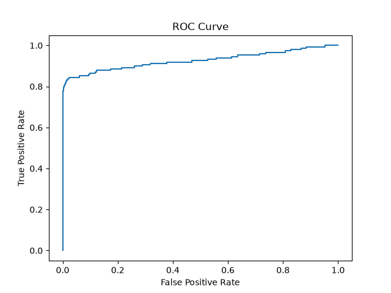
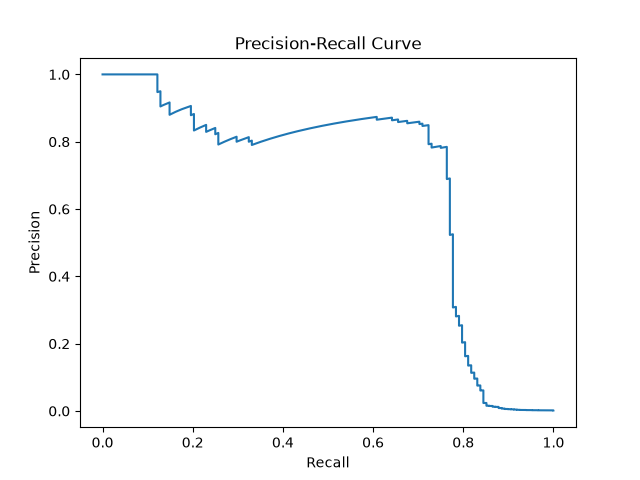
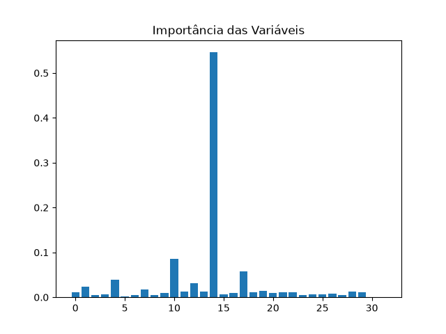

# Detecção de Fraudes em Cartão de Crédito 💳🔎

Projeto de análise de dados desenvolvido como **Lab Project** do *Bootcamp Bradesco - GenAI, Dados & Cyber*, na plataforma da **DIO**.

O objetivo é explorar um dataset público de transações de cartão de crédito e comparar diferentes abordagens de Machine Learning para identificar transações **fraudulentas**, um problema clássico de classificação com classes extremamente desbalanceadas.

## 📊 Sobre os dados

Os dados utilizados são o dataset público [`creditcard.csv`](https://storage.googleapis.com/download.tensorflow.org/data/creditcard.csv), contendo transações de cartão de crédito com as seguintes colunas:

- **Time**: momento da transação;
- **V1** a **V28**: variáveis numéricas já transformadas (via PCA), por questões de confidencialidade dos dados originais;
- **Amount**: valor da transação;
- **Class**: variável alvo — `0` para transação legítima e `1` para transação fraudulenta.

O dataset é fortemente desbalanceado: cerca de **99% das transações são legítimas**, o que torna a detecção das fraudes (a classe minoritária) o principal desafio do projeto.

## 🗂️ Estrutura do projeto

```
dio_deteccao_de_fraudes/
├── scripts/
│   ├── analises_graficas/
│   │   ├── importances.png
│   │   ├── precision_recall_curve.png
│   │   └── roc_curve.png
│   ├── balanceamento_dados.py
│   ├── dados_treino.py
│   ├── logistic_regression_model.py
│   ├── pipeline.py
│   ├── random_forest_model.py
│   └── xgboost_model.py
├── .gitignore
├── README.md
└── requirements.txt
```

## 📄 Descrição dos scripts

### `dados_treino.py`
Script central de preparação dos dados, reutilizado por todos os demais. Realiza:
- Leitura do dataset direto da URL pública;
- **Feature engineering**: transformação logarítmica (`log1p`) da coluna `Amount`, para reduzir a assimetria da distribuição de valores;
- **Padronização** (`StandardScaler`) da coluna `Amount`;
- Separação em `x` (features) e `y` (alvo `Class`);
- Divisão em treino e teste (`train_test_split`) com `stratify=y`, garantindo que a proporção de fraudes seja mantida em ambos os conjuntos.

### `balanceamento_dados.py`
Demonstra duas estratégias para lidar com o desbalanceamento das classes:
- **Undersampling**: redução do número de transações legítimas para igualar a quantidade de fraudes;
- **Oversampling (SMOTE)**: geração de exemplos sintéticos da classe minoritária (fraudes) com a técnica *Synthetic Minority Over-sampling Technique*, evitando a perda de informação que ocorre no undersampling.

### `logistic_regression_model.py`
Treina um modelo de **Regressão Logística**, algoritmo linear que estima a probabilidade de uma transação ser fraudulenta. Também:
- Gera a **Curva ROC** e calcula o **AUC** (área sob a curva), medindo a capacidade do modelo de distinguir as duas classes;
- Gera a **Curva Precision-Recall**, mais informativa que a ROC em cenários de forte desbalanceamento;
- Testa um **threshold customizado (0.3)** em vez do padrão (0.5), para aumentar a sensibilidade do modelo à detecção de fraudes.

### `random_forest_model.py`
Treina um modelo de **Random Forest**, um ensemble de árvores de decisão que reduz overfitting via *bagging*. Utiliza o parâmetro `class_weight="balanced"` para compensar o desbalanceamento das classes durante o treinamento, sem a necessidade de reamostrar os dados manualmente.

### `xgboost_model.py`
Treina um modelo **XGBoost** (*Extreme Gradient Boosting*), um ensemble de árvores construído de forma sequencial, em que cada nova árvore corrige os erros das anteriores. O parâmetro `scale_pos_weight=10` penaliza mais os erros na classe minoritária (fraudes). O script também gera um gráfico de **importância das variáveis**, mostrando quais features mais contribuem para as previsões do modelo.

### `pipeline.py`
Exemplo de uso de `Pipeline` do scikit-learn, encadeando o `StandardScaler` e a `LogisticRegression` em um único fluxo, o que simplifica o treinamento e evita vazamento de dados entre as etapas de pré-processamento e modelagem.

## 🤖 Algoritmos utilizados

| Algoritmo | Tipo | Ideia principal |
|---|---|---|
| **Regressão Logística** | Modelo linear | Estima a probabilidade de fraude a partir de uma combinação linear das variáveis, aplicando a função sigmoide. Simples, rápido e interpretável. |
| **Random Forest** | Ensemble (bagging) | Combina várias árvores de decisão treinadas em subconjuntos aleatórios dos dados, reduzindo a variância e o overfitting. |
| **XGBoost** | Ensemble (boosting) | Constrói árvores sequencialmente, onde cada árvore tenta corrigir os erros da anterior, geralmente resultando em alta performance. |

## 📈 Resultados

### Regressão Logística

```
              precision    recall  f1-score   support

           0       1.00      1.00      1.00     85295
           1       0.87      0.66      0.75       148

    accuracy                           1.00     85443
   macro avg       0.93      0.83      0.87     85443
weighted avg       1.00      1.00      1.00     85443
```

**Curva ROC:**



**Curva Precision-Recall:**



### Regressão Logística (threshold = 0.3)

Ao reduzir o threshold de decisão de 0.5 para 0.3, o modelo passa a classificar mais transações como fraude, aumentando o *recall* (mais fraudes detectadas) em troca de uma leve queda na *precision*:

```
              precision    recall  f1-score   support

           0       1.00      1.00      1.00     85295
           1       0.86      0.70      0.77       148

    accuracy                           1.00     85443
   macro avg       0.93      0.85      0.89     85443
weighted avg       1.00      1.00      1.00     85443
```

### Random Forest

```
              precision    recall  f1-score   support

           0       1.00      1.00      1.00     85295
           1       0.74      0.80      0.77       148

    accuracy                           1.00     85443
   macro avg       0.87      0.90      0.89     85443
weighted avg       1.00      1.00      1.00     85443
```

### XGBoost

O modelo com melhor desempenho geral no conjunto de teste, com o melhor equilíbrio entre precision e recall para a classe de fraudes:

```
              precision    recall  f1-score   support

           0       1.00      1.00      1.00     85295
           1       0.94      0.78      0.85       148

    accuracy                           1.00     85443
   macro avg       0.97      0.89      0.93     85443
weighted avg       1.00      1.00      1.00     85443
```

**Importância das variáveis:**



## 🏆 Conclusão

Todos os modelos apresentaram excelente desempenho para a classe majoritária (transações legítimas), o que já era esperado dado o desbalanceamento do dataset. A diferença real de performance aparece na classe minoritária (fraudes):

- A **Regressão Logística** teve o menor recall, deixando passar mais fraudes;
- Ajustar o **threshold** para 0.3 melhorou o recall com custo mínimo em precision;
- O **Random Forest**, com `class_weight="balanced"`, priorizou recall em detrimento da precision;
- O **XGBoost** apresentou o melhor F1-score (0.85) para a classe de fraudes, com o melhor equilíbrio entre precision (0.94) e recall (0.78), sendo o modelo mais indicado entre os testados para este problema.

## 🛠️ Tecnologias utilizadas

- Python
- pandas / numpy
- scikit-learn
- imbalanced-learn (SMOTE)
- XGBoost
- matplotlib

## ▶️ Como executar

```bash
# Criar e ativar o ambiente virtual
python -m venv .venv
source .venv/bin/activate  # Linux/Mac
.venv\Scripts\activate     # Windows

# Instalar as dependências
pip install -r requirements.txt

# Executar um dos scripts, por exemplo:
python scripts/xgboost_model.py
```

---

Projeto desenvolvido para fins educacionais no âmbito do *Bootcamp Bradesco - GenAI, Dados & Cyber* (DIO).